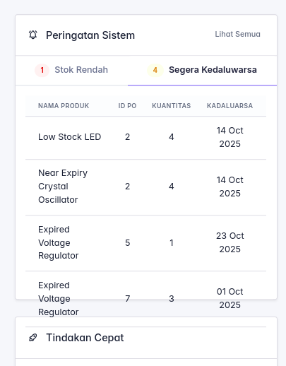

# Invent-MAG: Advanced Inventory & CRM Management System



**Version:** 1.2
**Author:** moogie3  
**License:** MIT  

---

## 📘 Introduction

Invent-MAG is a comprehensive, full-featured Inventory Management and Customer Relationship Management (CRM) system designed to streamline and optimize business operations. Built with a modern Laravel 11 stack, it provides robust tools for efficient stock tracking, sophisticated purchase and sales order management, real-time reporting, and granular user access control. This system is ideal for businesses requiring precise stock control, multi-user collaboration, and insightful data analytics to drive informed decisions.

---

## ✨ Key Features

Invent-MAG offers a powerful suite of functionalities to manage your business efficiently:

*   **Product & Stock Management:**
    *   Add, update, delete, and categorize inventory items with detailed product information.
    *   Track stock levels across multiple warehouses.
    *   Implement low-stock threshold alerts for proactive inventory planning.
    *   Manage stock adjustments (inflow/outflow) with clear reason codes.
*   **Purchase Order Management:**
    *   Create, manage, and track purchase orders from suppliers.
    *   Streamline the order approval process.
    *   Efficiently receive and reconcile stock upon order completion.
*   **Sales Order & Point of Sale (POS):**
    *   Generate and manage sales orders for customers.
    *   Integrated Point of Sale (POS) interface for quick and easy transactions.
    *   Track sales history and customer purchase patterns.
*   **Customer Relationship Management (CRM):**
    *   Manage customer profiles and interaction history.
    *   Track sales opportunities and manage sales pipelines.
    *   Analyze customer purchase history and preferences.
*   **Supplier Relationship Management (SRM):**
    *   Maintain detailed supplier profiles and interaction logs.
    *   Track purchase history from each supplier.
*   **Reporting & Analytics:**
    *   Generate real-time stock level reports, transaction logs, and financial summaries.
    *   Export reports to CSV/PDF for further analysis.
    *   Dashboard with key metrics for quick business insights.
*   **Multi-User Access & Security:**
    *   Role-based authentication and authorization (Admin, Manager, Staff) powered by Laravel Fortify and Spatie Laravel Permission.
    *   Secure user management with robust input validation and CSRF protection.
*   **Modern & Scalable Architecture:**
    *   Built on the robust Laravel 11 framework with a clean MVC design pattern.
    *   Utilizes MySQL for high performance and data integrity.

---

## 🚀 Technology Stack

Invent-MAG is built using a powerful and modern technology stack:

*   **Backend:**
    *   [**Laravel 11**](https://laravel.com/) (PHP Framework)
    *   **PHP 8.2+**
    *   [**Laravel Fortify**](https://laravel.com/docs/11.x/fortify) for authentication scaffolding.
    *   [**Laravel Sanctum**](https://laravel.com/docs/11.x/sanctum) for API authentication.
    *   [**Spatie Laravel Permission**](https://spatie.be/docs/laravel-permission/v6) for role and permission management.
    *   [**PHPUnit 11.0.1+**](https://phpunit.de/) for backend testing.
*   **Frontend:**
    *   **Blade Templates**
    *   [**Alpine.js 3.4.2+**](https://alpinejs.dev/) for declarative JavaScript.
    *   [**Tailwind CSS 3.1.0+**](https://tailwindcss.com/) for utility-first styling.
    *   [**Vite 6.0+**](https://vitejs.dev/) for a fast development build experience.
    *   [**Axios 1.7.4+**](https://axios-http.com/) for HTTP requests.
    *   [**Vitest 4.0.9+**](https://vitest.dev/) for frontend testing.
*   **Database:**
    *   **MySQL** (Recommended)
    *   SQLite (for development/testing)

---

## ⚙️ Getting Started

Follow these steps to set up and run Invent-MAG on your local machine.

### Prerequisites

Ensure you have the following installed:

*   **PHP 8.2+**
*   **Composer**
*   **Node.js (LTS recommended)**
*   **NPM or Yarn**
*   **MySQL (or another compatible database)**

### Installation Steps

1.  **Clone the Repository:**
    ```bash
    git clone https://github.com/moogie3/invent-mag.git
    cd invent-mag
    ```

2.  **Install PHP Dependencies:**
    ```bash
    composer install
    ```

3.  **Install JavaScript Dependencies:**
    ```bash
    npm install
    # or yarn install
    ```

4.  **Environment Configuration:**
    *   Copy the example environment file:
        ```bash
        cp .env.example .env
        ```
    *   Generate an application key:
        ```bash
        php artisan key:generate
        ```
    *   Configure your database connection in the `.env` file. For MySQL, ensure `DB_CONNECTION`, `DB_HOST`, `DB_PORT`, `DB_DATABASE`, `DB_USERNAME`, and `DB_PASSWORD` are correctly set.

5.  **Run Database Migrations and Seeders:**
    ```bash
    php artisan migrate --seed
    ```
    This will create the necessary database tables and populate them with initial data (including a superuser account).

6.  **Build Frontend Assets:**
    ```bash
    npm run build
    ```
    This compiles your CSS and JavaScript assets for production. For development, you can run `npm run dev` to watch for changes.

7.  **Serve the Application:**
    ```bash
    php artisan serve
    ```
    The application will typically be available at `http://127.0.0.1:8000`.

---

## 🧪 Running Tests

Invent-MAG includes a comprehensive test suite for both backend and frontend to ensure reliability and maintainability.

### Backend Tests (PHPUnit)

To run the PHPUnit tests for the Laravel backend:

```bash
php artisan test
```

### Frontend Tests (Vitest)

To run the Vitest tests for the JavaScript frontend:

```bash
npm run test:js
```

---

## 🤝 Support & Contributions

If you encounter any issues, feel free to submit an issue on GitHub. Pull requests are welcome!

---

## 📜 License

Invent-MAG is software licensed under the **MIT License**. See the `LICENSE` file for more details.

---
